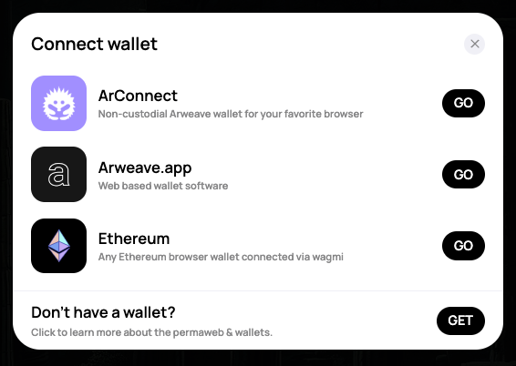

# AO Wallet Kit

React Hooks and Components for preconfigured and customizable interactions on
AO.

<!-- toc -->

- [Supported wallets](#supported-wallets)
- [Installation](#installation)
- [Setup](#setup)
- [Terminology of Arweave Wallet Kit](#terminology-of-arweave-wallet-kit)
  - [Strategies](#strategies)
- [Config](#config)
  - [App config](#app-config)
    - [Wallet Options](#wallet-options)
    - [Custom EVM Provider through Wagmi strategy](#custom-evm-provider-through-wagmi-strategy)
    - [Available options](#available-options)
  - [Custom theme](#custom-theme)
    - [Available options](#available-options-1)
      - [Font](#font)
- [Connect Button](#connect-button)
  - [Usage](#usage)
  - [Config](#config-1)
- [Hooks](#hooks)
  - [`useConnection`](#useconnection)
    - [Usage](#usage-1)
  - [`useApi`](#useapi)
    - [Usage](#usage-2)
  - [`useProfileModal`](#useprofilemodal)
  - [`useAddress`](#useaddress)
    - [Usage](#usage-3)
  - [`usePublicKey`](#usepublickey)
    - [Usage](#usage-4)
  - [`usePermissions`](#usepermissions)
    - [Usage](#usage-5)
  - [`useAddresses`](#useaddresses)
    - [Usage](#usage-6)
  - [`useWalletNames`](#usewalletnames)
    - [Usage](#usage-7)
  - [`useStrategy`](#usestrategy)
    - [Usage](#usage-8)
  - [`useStrategies`](#usestrategies)
    - [Usage](#usage-9)
  - [`useAoSigner`](#useaosigner)
    - [Usage](#usage-10)
  - [`useBalance`](#usebalance)
    - [Usage](#usage-11)
  - [`useGatewayURL`](#usegatewayurl)
    - [Usage](#usage-12)

<!-- tocstop -->

## Supported wallets

- [ArConnect](https://arconnect.io)
- [Arweave.app](https://arweave.app)
- [Metamask](https://metamask.io/)
- [Phantom](https://phantom.app/)
- Any wallet that injects the `window.ethereum` or `window.arweaveWallet` API
  (wagmi is used internally)
- Allows for custom strategies to be implemented so future integrations can be
  added!

## Installation

```sh
yarn add @project-kardeshev/ao-wallet-kit
```

or

```sh
npm i @project-kardeshev/ao-wallet-kit
```

## Setup

To use the library, you'll need to wrap your application with the Kit Provider.

```tsx
const App = () => {
  return (
    <AOWalletKit>
      <YourApp />
    </AOWalletKit>
  );
};
```

## Terminology of Arweave Wallet Kit

### Strategies

AO Wallet Kit supports a _strategies_ API. **Strategy** means an implementation
of a **Wallet connector** in the Kit. These strategies allow the user to
communicate with all wallets the same way and with the same API. See
[here for more info.](#custom-evm-provider-through-wagmi-strategy)

## Config

The Arweave Wallet Kit can be configured with information about your application
and with a custom theme.

```tsx
...
  <AOWalletKit
    config={{
      permissions: ["ACCESS_ADDRESS"],
      ensurePermissions: true,
      ...
    }}
    theme={{
      accent: { r: 255, g: 0, b: 0 },
      ...
    }}
  >
    <YourApp />
  </AOWalletKit>
...
```

### App config

Using the `config` field of the `<AOWalletKit>` provider component, you can
define a name, a logo or the required permissions for your app, ass well as
supported wallets by settings strategies. By default all wallets will be
supported if no overrides are provided.

#### Wallet Options

```tsx
import {
  AOWalletKit,
  ArConnectStrategy,
  ArweaveWebWalletStrategy,
  ethereumStrategy,
} from '@project-kardeshev/ao-wallet-kit';

<AOWalletKit
  config={{
    permissions: [
      'SIGN_TRANSACTION',
      'ENCRYPT',
      'DECRYPT',
      'ACCESS_ADDRESS',
      'SIGNATURE',
      'ACCESS_PUBLIC_KEY',
    ],
  }}
  strategies={[
    new ArConnectStrategy(),
    new ArweaveWebWalletStrategy(),
    ethereumStrategy,
  ]}
>
  <App />
</AOWalletKit>;
```

This will show the ArConnect, Arweave.app, and Ethereum Wagmi strategy, but not
the Othent strategy for example. If you did not want Ethereum supported, then
you would exclude the `ethereumStrategy`.



#### Custom EVM Provider through Wagmi strategy

You can create your own strategy for an EVM chain by extending the Wagmi
Strategy. The resulting strategy can passed in to the `<AOWalletKit>` context as
shown in [the section above](#wallet-options)

```tsx
import { WagmiStrategy } from '@project-kardeshev/ao-wallet-kit';
import { createConfig, http } from '@wagmi/core';

// Initialize wagmi config like you would normally for a wagmi provider
export const ethereumWagmiConfig = createConfig({
  chains: [mainnet, sepolia],
  transports: {
    [mainnet.id]: http(),
    [sepolia.id]: http(),
  },
});

export const ethereumStrategy = new WagmiStrategy({
  id: 'ethereum',
  name: 'Ethereum',
  description: 'Any Ethereum browser wallet connected via wagmi',
  theme: '0,0,0',
  // arweave ID to the logo for the strategy, retrieves from the gateway
  logo: '4M9wYB5x1e-opn-cPEoLDt1pHP-tKMRpJ56uVGTUeog',
  // pass in the config to the strategy
  wagmiConfig: ethereumWagmiConfig,
});
```

#### Available options

| Prop                | Type                                                                                  | Default             |                                                                                                            |
| ------------------- | ------------------------------------------------------------------------------------- | ------------------- | ---------------------------------------------------------------------------------------------------------- |
| `permissions`       | [`PermissionType[]`](https://docs.arconnect.io/api/connect#permissions)               | `[]`                | Permissions to connect with.                                                                               |
| `ensurePermissions` | `boolean`                                                                             |  `false`            | Ensure that all required permissions are present. If false, it only checks if the app has any permissions. |
| `appInfo`           | [`AppInfo`](https://docs.arconnect.io/api/connect#additional-application-information) | `{}`                | Information about your app (name/logo).                                                                    |
| `gatewayConfig`     | `GatewayConfig`                                                                       | arweave.net gateway | Configuration for the Arweave gateway to use.                                                              |

### Custom theme

With the `theme` field, you can define a custom theme configuration for the
Arweave Wallet Kit modals and buttons.

#### Available options

| Prop             | Type                               |                                                                        |
| ---------------- | ---------------------------------- | ---------------------------------------------------------------------- |
| `displayTheme`   | `"dark"`, `"light"`                | UI display theme to use                                                |
| `accent`         | `RGBObject`                        | RGB accent color for the UI                                            |
| `titleHighlight` | `RGBObject`                        | RGB accent color for the subscreen titles (like the connection screen) |
| `radius`         | `"default"`, `"minimal"`, `"none"` | Border radius level used throughout the Kit UI                         |
| `font`           | `Font`                             | Including font family used throughout the Kit UI                       |

##### Font

The `font` field in the theme configuration allows you to specify the font
family to be used throughout the Kit UI. It should be an object with a
`fontFamily` property, which is a string representing the font family. If
nothing is specified, the default font family is `Manrope` with a fallback to
the next available sans-serif font in the system.

Here's an example of how to use it:

```tsx
...
<AOWalletKit
  theme={{
    font: {
      fontFamily: "Arial"
    },
    // other theme properties...
  }}
/>
...
```

## Connect Button

To quickly integrate the Arweave Wallet Kit, you can use the `<ConnectButton>`
component. It is a highly customizable button that supports displaying profile
information about the connected wallet.

### Usage

```tsx
import {ConnectButton} from '@project-kardeshev/ao-wallet-kit'

<ConnectButton
  accent="rgb(255, 0, 0)"
  profileModal={false}
  showBalance={true}
  ...
/>
```

### Config

You can configure the Connect Button through it's props.

| Props                | Type      |                                                                                         |
| -------------------- | --------- | --------------------------------------------------------------------------------------- |
| `accent`             | `string`  |  A theme color for the button                                                           |
| `showBalance`        | `boolean` | Show user balance when connected                                                        |
| `showProfilePicture` | `boolean` | Show user profile picture when connected                                                |
| `profileModal`       | `boolean` | Show profile modal on click (if disabled, clicking the button will disconnect the user) |

## Hooks

Inside the [`<AOWalletKit>`](#setup), you can use all kinds of hooks that are
reactive to the different [strategies](#terminology-of-arweave-wallet-kit). Some
of the hooks / api functions might not be supported by all wallets.

### `useConnection`

The core hook for connecting / disconnecting a
[strategy](#terminology-of-arweave-wallet-kit).

#### Usage

```ts
import { useConnection } from '@project-kardeshev/ao-wallet-kit';

const { connected, connect, disconnect } = useConnection();

// initiate connection
await connect();

// disconnect the connected strategy
await disconnect();

// is there a strategy connected?
connected ? 'wallet connected' : 'no connected wallet';
```

### `useApi`

API hook. Returns the active strategy's API as an interactable object. Can be
used to sign/encrypt, etc.

**Some API functions might not be supported depending on the
[strategy](#terminology-of-arweave-wallet-kit) the user chose. For example,
Othent does not support the `signature()` function.** Make sure to verify
beforehand.

#### Usage

```ts
import { useApi } from '@project-kardeshev/ao-wallet-kit';
const api = useApi();

// sign
await api.sign(transaction);

// encrypt
await api.encrypt(...)
```

### `useProfileModal`

Toggle / display a modal with profile information and a disconnect button.

```ts
import { useProfileModal } from '@project-kardeshev/ao-wallet-kit';

const profileModal = useProfileModal();

profileModal.setOpen(true);
```

### `useAddress`

Active address hook. Requires the `ACCESS_ADDRESS` and the
`ACCESS_ALL_ADDRESSES` permission.

#### Usage

```ts
import { useAddress } from '@project-kardeshev/ao-wallet-kit';

const address = useAddress();
```

### `usePublicKey`

Active public key hook. Requires the `ACCESS_PUBLIC_KEY` permission.

#### Usage

```ts
import { usePublicKey } from '@project-kardeshev/ao-wallet-kit';

const publicKey = usePublicKey();
```

### `usePermissions`

Permissions hook. Returns the permissions given to the app, known by Arweave
Wallet Kit.

#### Usage

```ts
import { usePermissions } from '@project-kardeshev/ao-wallet-kit';

const permissions = usePermissions();
```

### `useAddresses`

All addresses hook. Returns the addresses in the connected wallet, known by
Arweave Wallet Kit. Requires the `ACCESS_ALL_ADDRESSES` permission.

#### Usage

```ts
import { useAddresses } from '@project-kardeshev/ao-wallet-kit';

const addresses = useAddresses();
```

### `useWalletNames`

All addresses hook. Returns the addresses in the connected wallet, known by
Arweave Wallet Kit. Requires the `ACCESS_ALL_ADDRESSES` permission. Note this is
note available for Ethereum wallets.

#### Usage

```ts
import { useWalletNames } from '@project-kardeshev/ao-wallet-kit';

const walletNames = useWalletNames();
```

### `useStrategy`

Active strategy hook. Returns the currently used strategy's ID.

#### Usage

```ts
import { useStrategy } from '@project-kardeshev/ao-wallet-kit';

const strategy = useStrategy();
```

### `useStrategies`

Returns the configured strategies in the context provider. This can be useful
for display information about supported wallets.

#### Usage

```ts
import { useStrategies } from '@project-kardeshev/ao-wallet-kit';

const strategies = useStrategies();
```

### `useAoSigner`

Listens to the active strategy and returns the current AO signer from it.

#### Usage

```ts
import { useAoSigner } from '@project-kardeshev/ao-wallet-kit';

const aoSigner = useAoSigner();
```

### `useBalance`

Listens to the active address and returns the current Arweave balance for it.

#### Usage

```ts
import { useBalance } from '@project-kardeshev/ao-wallet-kit';

const arweaveBalance = useBalance();
```

### `useGatewayURL`

Listens to the gateway config and returns the URL for the gateway.

#### Usage

```ts
import { useBalance } from '@project-kardeshev/ao-wallet-kit';

const arweaveBalance = useBalance();
```
